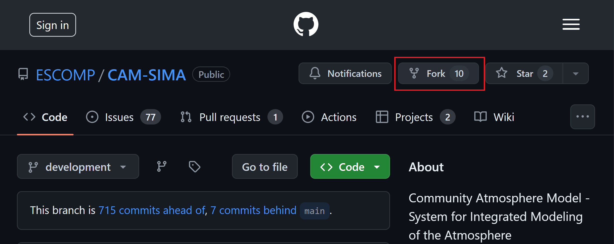

# CAM Parameterization to CCPP

## Background

### Running jobs in CAM and CAM-SIMA primer (experienced users can jump to the next section)

To make runs in either CAM or CAM-SIMA the commands are identical:
```bash
./create_newcase… #(the commands will differ and are specified later in this document)
cd YourCaseDirectory
./xmlchange… #(specific commands are specified later in this document)
./case.setup
./case.build
./case.submit
```

Depending on which machine you are on, you may prefer to run the ./case.build command on a compute node instead of the login node due to user resource utilization limits on the login nodes.

For more detailed information on case creation and building, see https://ncar.github.io/CAM/doc/build/html/users_guide/building-and-running-cam.html

## Prep Work

### Conversion Spreadsheet
Put the parameterization that you are going to convert into the conversion spreadsheet
https://docs.google.com/spreadsheets/d/1_1TTpnejam5jfrDqAORCCZtfkNhMRcu7cul37YTr_WM/edit#gid=0

### Create Github Issues
Create a Github Issue in the [ESCOMP/CAM](https://github.com/ESCOMP/CAM) repo that states which physics parameterization you are planning to convert to the CCPP framework.  Then create another issue in the [ESCOMP atmospheric physics](https://github.com/NCAR/atmospheric_physics) repo describing the same physics parameterization that you are now planning to add to the collection of NCAR CCPP physics suites.  Doing this allows the software engineers to keep track of which physics routines are being worked on, and which still need to be assigned.  The goal of converting the physics parameterization is to ultimately have the CCPP-ized physics package reside in [ESCOMP atmospheric physics](https://github.com/NCAR/atmospheric_physics) and be removed from [ESCOMP/CAM](https://github.com/ESCOMP/CAM).

### Setting up your sandbox

Make sure you have github forks for both ESCOMP/CAM-SIMA and ESCOMP/atmospheric_physics.  If needed see https://github.com/ESCOMP/Cam/wiki/CAM-Development-Workflow-in-GitHub#how-to-makestore-revisions-to-your-personal-cam-repository-github-fork


To begin, fork ESCOMP/CAM-SIMA:


```bash
git clone  https://github.com/<GithubUserID>/CAM-SIMA
cd CAM-SIMA

```

NOTE: As you make changes and want to commit them to your github repos, you’ll be managing two separate repos.  When you issue git commands, be aware of where you are in your code tree.  If you want to see changes in CAM-SIMA, you can issue a “git status” in the main CAM-SIMA directory.  If you want to see changes in the atmospheric_physics repo, make sure you are in src/physics/ncar_ccpp before you issue the “git status” command.  All other git commands will be relative to your current working directory as well.
