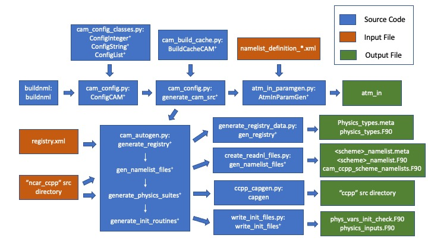

# CAM-SIMA Build Process

In order to describe the build process, we need to define several source and build directories:

* `<srcroot>` : The CAM-SIMA sandbox being built. From a case directory, this can be found with `./xmlquery SRCROOT.`
* `<caseroot>`: The location of the case being built.
* `<src_mods>`: The location of the CAM-SIMA source mods, located at `<caseroot>/SourceMods/src.cam.`
* `<bldroot>` : The location of CAM-SIMA generated code and compiled code (`.o` and `.mod`). See `atm/obj` under `./xmlquery OBJROOT`.

<!-- -->
## Build Sequence

Given the context above, the following is the CAM-SIMA build sequence:

1. Create a `ConfigCAM` object, used to store build configuration information. Code can be found in `<srcroot>/cime_config/cam_config.py`
    - Inputs:
        - `<case>`: A CIME case object
        - `<case_log>`: A python logger, which is usually created by CIME itself
    - Outputs:
        - `config_dict`: A dictionary of configure options, with the dictionary keys being the name of the config variable/option, and the dictionary values being special config variable objects that contain the following properties:
            - `name`: The name of the config option/variable. This is what is used as the key in the `config_dict` dictionary
            - `desc`: A text description of what this particular config option is, and what sort of values the config option should have.
            - `value`: The value of that config option/variable. Currently can only be an integer, string, or list of integers or strings.
            - `valid_vals`: Optional property that contains either a list or range of valid values for this particular config entry
            - `valid_type`: Optional property for a list-type config option that states what data type the list elements can have.
            - `is_nml_attr`: Logical that states whether this config option can be used as an XML attribute in a namelist definition file.
    - Additional info:
        - The `ConfigCAM` object also has various build-in methods that are used to call other steps in the build workflow, change the value of a given config variable, or print extra config info to the provided python logger.
        - The `ConfigCAM` object currently has no uses outside `buildnml` and `buildlib`, and so is not saved after those steps are complete.
1. Generate CAM-SIMA source code. This sequence has several steps, each of which is performed if any of its inputs has changed.
    - Create or read in a `BuildCacheCAM` object (`<srcroot>/cime_config/cam_build_cache.py`).
        - `<build_cache>`: An optional cache file (created by previous build). This file is created in the case build directory (bld/atm/obj).
    - Create the physics derived data types using the registry (if required).
    - Find all scheme metadata files for configured suites.
    - Find any active schemes with namelist XML variables
        - Create metadata file with namelist variables
        - Create namelist-reading module (to go with metadata file).
    - Call the [CCPP Framework](https://ccpp-techdoc.readthedocs.io/en/v6.0.0/) to generate glue code (CAPS), (if required).

## CAM-SIMA source and namelist generation (buildnml) workflow

The diagram above displays everything that occurs when CAM-SIMA's `buildnml` is called by CIME, which occurs after the user calls `preview_namelists`, `case.build`, or `case.submit`.

All blue boxes represent source code, and are listed as "source file: function/object used", and all objects or functions that have a "+" are automatically tested whenever a Pull Request is opened, updated, or merged.

All orange boxes are input files that are used by the code, while all green boxes are output files that are generated. It is important to note that additional files are generated as well, specifically a build cache and a CCPP datatable, but those files are used internally in the build scripts shown here and not by the final model executable, and thus aren't listed here.

Finally, the arrows show the order of operations, starting with `buildnml`, with the top two source code boxes representing python classes that are used by the functions/objects directly below them.