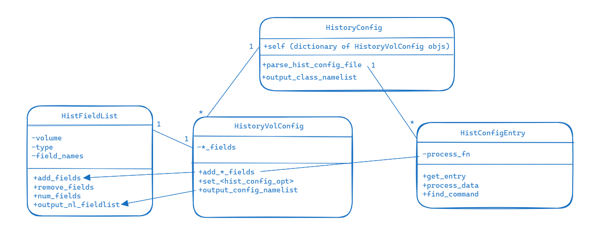

# History & Model Output

CAM-SIMA history is the mechanism for configuring and generating diagnostic output from a model run. It is also used to generate initial-data files and aids in the model-restart process by saving the state of diagnostic fields whose processing window (e.g., averaging, standard deviation) crosses a restart-write cycle. This page describes the implementation of CAM-SIMA history in CAM-SIMA.

## History Initialization
### Reading and processing the history configuration

- The allowable history configuration keywords are defined in `cime_config/hist_config.py` in `_HIST_CONFIG_ENTRY_TYPES`.
    - Each of the keywords is configurable via the namelist (`user_nl_cam`)
    - The syntax is `<keyword>;<volume>: <value>` (see examples below)
    - Currently, these configuration keywords are as follows (the `atm_in` equivalent indicates how `hist_config.py` parses these into a namelist to be read by SIMA):

| Configuration Keyword | Description | atm_in equivalent |
|:--------------------- | ----------- | ----------------- |
| hist_add_avg_fields <br />hist_add_inst_fields<br />hist_add_min_fields<br /> hist_add_max_field<br /> hist_add_var_field<br /> hist_remove_fields| These configuration keywords add/remove fields to the specified volume with the indicated accumulation flag (average, instantaneous, minimum, maximum, standard deviation). The closest CAM7 equivalent is “finclX”|&hist_config_arrays_nl<br/>&ensp;hist_num_avg_fields<br/>&ensp;hist_num_inst_fields<br/>&ensp;hist_num_min_fields<br/>&ensp;hist_num_max_fields<br/>&ensp;hist_num_var_fields<br/><br/>&hist_file_config_nl<br/>&ensp;hist_avg_fields<br/>&ensp;hist_inst_fields<br/>&ensp;hist_min_fields<br/>&ensp;hist_max_fields<br/>&ensp;hist_var_fields|
| hist_file_type        | This keyword determines the type of file. Options are: “history,” “satellite,” and “initial_value”<br/>Defaults to “history” | &hist_file_config_nl<br/>&ensp;hist_file_type |
| hist_max_frames       | Indicates the maximum number of samples/frames that can be written to a file before that file is considered “full”. The CAM7 equivalent is “mfilt”.<br/>Defaults to 1 for h0 and 30 for all other volumes. | &hist_file_config_nl<br/>&ensp;hist_max_frames |
| hist_output_frequency | Specifies the frequency of writes to the volume. The syntax is “*” where “time_period” can be: steps, seconds, minutes, hours, days, months, years. The closest CAM7 equivalent is “nhtfrq”. | &hist_file_config_nl<br/>&ensp;hist_output_frequency |
| hist_precision        | Denotes the precision for the volume. Options are "REAL32" and "REAL64".<br/>Defaults to "REAL32" | &hist_file_config_nl<br/>&ensp;hist_precision |
| hist_write_nstep0     | Specifies the template for the filename for the volume. <br/> Defaults to "%c.cam.%u.%y-%m-%d-%s.nc" where "%c" is the case name, "%u" is the volume, "%y" is the year, "%m" is the month, "%d" is the day, and "%s" is the seconds | &hist_file_config_nl<br/>&ensp;hist_filename_spec

- `hist_config.py` also contains the `HistoryVolConfig` class (all the info pertaining to a single history file), the `HistoryConfig` class (all the history configuration information including a dict of `HistoryVolConfig` objects), and helper classes.
- The `HistoryConfig` object is created in `buildnml` out of entries in `user_nl_cam` and written to `run/atm_in`.
- In order to ensure that all relevant runtime (namelist) values show up in `atm_in`, the `HistoryConfig` object must contain all the logic in setting default values.



**Example**
Take the following sample `user_nl_cam`:
```
hist_output_frequency;h1: 5*ndays
hist_max_frames;h1: 3
hist_add_inst_fields;h1: U
hist_add_inst_fields;h1: V, Q
hist_precision;h1: REAL64
hist_filename_spec;h1: my-history-file%m-%d
hist_write_nstep0;h1: .false.
```

It will be parsed by hist_config.py and this will be the relevant section of atm_in:
```
&hist_config_arrays_nl
    hist_num_inst_fields = 3
    hist_num_avg_fields = 2
    hist_num_min_fields = 0
    hist_num_max_fields = 0
    hist_num_var_fields = 0
/

&hist_file_config_nl
    hist_volume = 'h0'
    hist_avg_fields = 'T', 'Q'
    hist_max_frames = 1
    hist_output_frequency = '1*month'
    hist_precision = 'REAL32'
    hist_file_type = 'history'
    hist_filename_spec = '%c.cam.%u.%y-%m-%d-%s.nc'
    hist_write_nstep0 = .false.
/

&hist_file_config_nl
    hist_volume = 'h1'
    hist_inst_fields = 'U', ‘V’, ‘Q’
    hist_max_frames = 3
    hist_output_frequency = '5*ndays'
    hist_precision = 'REAL64'
    hist_file_type = 'history'
    hist_filename_spec = 'my-history-file%m-%d'
    hist_write_nstep0 = .false.
/
```

In plain English, a one-month run with these history configuration will result in a total of three files that will look something like these:
- my-history-file01-06.nc
    - This file will contain instantaneous output for U, V, and Q (eastward_wind, northward_wind, and water vapor)
    - It will contain three frames, one at each of the following times:
        - 0001-01-06 (time=5)
        - 0001-01-11 (time=10)
        - 0001-01-16 (time=15)
- my-history-file01-21.nc
    - This file will contain instantaneous output for U, V, and Q (eastward_wind, northward_wind, and water vapor)
    - It will contain three frames, one at each of the following times:
        - 0001-01-21 (time=20)
        - 0001-01-26 (time=25)
        - 0001-01-31 (time=30)
- <case-name>.cam.h0a.0001-02-01-00000.nc
    - This file will contain averaged output for T and Q (air_temperature and water vapor)
    - It will have one frame with the time calculated at the midpoint of the month

### Setting up the history data structures

- History namelist information is read and history data structures are set up in `src/history/cam_hist_file.F90`
- The driving function in `cam_hist_file.F90` is `hist_read_namelist_config`, which is called by `history_readnl` in `src/history/cam_history.F90`. This function reads in the hist_config_arrays_nl namelist group, allocates the history field arrays, and then uses those arrays to read in the hist_file_config_nl namelist group (via a call to `read_namelist_entry`).
- The history configuration namelist options are used to populate `cam_history.F90`’s module-level hist_configs array of `hist_file_t` objects (the size of this array is the number of user-configured volumes).
- The `hist_file_t` object contains information about the configuration options for a given history volume. This includes the maximum number of frames that can be written to the file, the current number of frames on the file, the name of the file, and all of the history fields to be written to the file. It also contains methods to populate the field lists (`config_set_up_fields`), set up the metadata of the file (`config_define_file`), and write history fields to the file (`config_write_time_dependent_variables`).
- Each `hist_file_t` object contains both a hash table and allocatable field list to keep track of the fields written to the file. The core class for each of these is the `hist_field_info_t` (in `src/history/buffers/src/hist_field.F90`), which contains information about a history field. This includes the field names, the accumulate flag (average, instantaneous, minimum, etc), units, type, dimensions, and fill value. It also includes the buffer(s) (type is/are `hist_buffer_t`) that will and do hold the actual data.


## Populating the possible field list
The possible fields to be output by the history infrastructure are tracked in `cam_history.F90` via the `possible_field_list` hash table. It is populated during init time by calls to the subroutine `history_add_field` (found in `src/history/cam_history.F90`). “Init time,” means that all calls to `history_add_field` must occur during the execution of `cam_init` (found in `src/control/cam_comp.F90`).

- Within the CCPP physics, this means that any diagnostic fields must be added to possible field list during _init (ideally the diagnostics are kept separate from the core scheme physics to keep the physics portable)
- Within dynamics, the fields must be added during `dyn_init` or `stepon_init`
- For physics variables:
    - State variables are added to the field list in the init phase of the cam_state_diagnostics scheme in `src/physics/ncar_ccpp/diagnostics/cam_diagnostics.F90`
        - This scheme is included at the end of the `physics_before_coupler` group in the suite definition file (SDF)
    - Tendency variables are added to the field list in the init phase of the `cam_tend_diagnostics` scheme in `src/physics/ncar_ccpp/diagnotics/cam_diagnostics.F90`
        - This scheme is included at the end of the `physics_after_coupler` group in the SDF
    - Additional variables specific to the scheme are included in the init phase of a <scheme>_diagnostics scheme in `src/physics/ncar_ccpp/diagnostics`

Each call to `history_add_field` adds a new field to the end of the `possible_field_list_head` linked list. At the end of `cam_init`, the possible field list linked list is used to print the list (to the atm.log* file) and then is converted to the `possible_field_list` hash table. A sample of the history field list is seen below.
```
  ***************** HISTORY FIELD LIST ******************
             T          K  avg  air_temperature
            ZM          m  avg  geopotential_height_wrt_surface
          PHIS     m2 s-2  ins   surface_geopotential
          PMID         Pa  avg  air_pressure
       PDELDRY         Pa  avg  air_pressure_thickness_of_dry_air
             Q    kg kg-1  avg  water_vapor_mixing_ratio_wrt_moist_air_and_condensed_water
        CLDLIQ    kg kg-1  avg cloud_liquid_water_mixing_ratio_wrt_moist_air_and_condensed_water          
        RAINQM    kg kg-1  avg  rain_mixing_ratio_wrt_moist_air_and_condensed_water
         TTEND      K s-1  avg  tendency_of_air_temperature_due_to_model_physics
  *************** END HISTORY FIELD LIST ****************
```
## Capturing history output
Outside of CAM-SIMA init and finalize time, history buffers can be populated with data via a call to `history_out_field` (found in `src/history/cam_history.F90`)

The subroutine `history_out_field` iterates over the `hist_configs` array and populates the buffer(s) of the `hist_field_info_t` object of the `hist_file_t` object if the field name in the call is active on that file (e.g. the field was configured via the namelist to be output for that volume).

- Within the CCPP physics, calls to `history_out_field` can exist anywhere except _init and _final
- In dynamics, calls to `history_out_field` can exist anywhere except in `dyn_init`, `stepon_init`, and `stepon_final`
- For physics variables, `history_out_field` calls are included in the run phase of the same schemes described in the section above.

## Defining new history files
The `cam_history.F90` subroutine `history_write_files` (which is called during `cam_timestep_final`) does three main actions for each of the user-defined history volumes:

1. Determine if it’s time to write to the file based on the user-supplied namelist option hist_output_frequency
1. **If it's time to write, determine if we need to open a new file**
1. Write the variables to the file(s)

The bolded step #2 above is what determines if we need to define a new history file. The situations where we would need to define a new file are:

1. It's the first sample we're outputting to a specific volume.
1. The last time we output to the volume, we "filled" the file (number of samples written to the file met the user-configured `hist_max_frames`) and closed it

We determine if it's time for a new file with the following line of code:
```
   mod(num_samples, hist_configs(file_idx)%max_frame()) == 0
```

If it is indeed time to define a new file, we call the `config_define_file` subroutine (which is found in `src/history/cam_hist_file.F90`) for the volume:
```
  call hist_configs(file_idx)%define_file(restart, logname, host, model_doi_url)
```

- This subroutine opens the netcdf file(s) and writes the necessary time-independent metadata (for the file and for the history fields) and grid information.
    - Note that there will be a maximum of TWO (2) files opened at this stage. If there are both instantaneous fields AND accumulated fields (average, minimum, maximum, standard deviation) on the volume, two files will be created (hXi AND hXa); otherwise, only the relevant file will be created (hXi OR hXa)

## Writing a history file
The `cam_history.F90` subroutine `history_write_files` (which is called during `cam_timestep_final`) does three main actions for each of the user-defined history volumes:

1. Determine if it’s time to write to the file based on the user-supplied namelist option hist_output_frequency
1. If it's time to write, determine if we need to open a new file
1. **Write the variables to the file(s)**

The bolded step #3 above occurs any time the criteria for #1 is satisfied. At this point, the following call is made to write the history fields (whose data has been stored in their buffers via calls to `history_out_field`):
```
  call hist_configs(file_idx)%write_time_dependent_variables(file_idx, restart)
```
It is during this call that we increment the number of samples written for this volume and actual write the data held within the buffer(s) to the netcdf file (as well as the time-dependent metadata for the fields).

## Defining history restart files
*Restarts not yet implemented in CAM-SIMA*

## Writing a history restart file
*Restarts not yet implemented in CAM-SIMA*

## Reading a history restart file
*Restarts not yet implemented in CAM-SIMA*